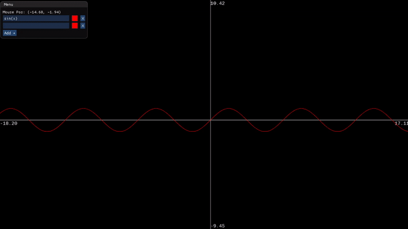

# Graphing-Calculator
Graphing calculator made in SFML/C++

# Demo

# Libraries
- [SFML](https://www.sfml-dev.org/) - OpenGL context, window creation, input handling and more
- [ExprTk](http://www.partow.net/programming/exprtk/index.html) - Math expression parsing and evaluating
- [ImGui](https://github.com/ocornut/imgui) - GUI library
